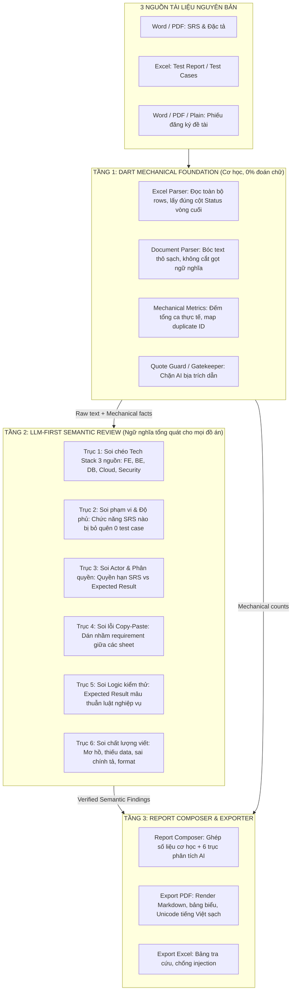

# LLM-First Semantic Review & Mechanical Dart Foundation

## 1. Bối cảnh & Vấn đề kiến trúc cũ
- **Vấn đề:** Code Dart đang cố gắng làm việc của LLM (dùng regex bắt tĩnh `database:`, `# heading` để tìm Use Case, đếm từ để chấm điểm diễn đạt).
- **Hậu quả:** 
  - Đổi template tài liệu là regex vỡ: Bỏ sót lệch CSDL/Cloud (`Environment: Vercel, Azure SQL` vs `PostgreSQL`), đếm nhầm 5 use case từ tiêu đề chương Word, lấy nhầm cột `Round 1` thay vì `Round 3` dẫn đến báo sai 34 ca FAILED.
  - Càng vá regex càng đẻ ra bug, không bao giờ tổng quát được cho mọi đồ án (Web, Mobile, AI, IoT...).

---

## 2. Kiến trúc mới: Tách bạch rõ 2 tầng

---

## 3. Các Phase triển khai chi tiết

### Phase 1: Chuẩn hóa tầng trích xuất cơ học (Dart Mechanical Foundation)
1. **Sửa Header Resolver (`test_case_schema.dart`):**
   - Không dùng `putIfAbsent` gây đè cột cũ.
   - Thêm cơ chế `Latest Round Priority`: Ưu tiên `Final Status / Actual Result` $\rightarrow$ Nếu có `Round 1, Round 2, Round 3` thì tự động lấy Round có số lớn nhất (`Round 3`), bỏ qua các Round trước.
2. **Loại bỏ regex ngữ nghĩa rác trong Dart:**
   - Bỏ regex tìm `database:` cứng trong `cross_check_engine.dart`.
   - Bỏ logic bóc Use Case bằng `# heading` trong `coverage_stats.dart`. Chuyển việc đánh giá độ phủ nghiệp vụ sang LLM.
   - Giữ lại các phép đếm cơ học thuần túy: Tổng số ca trong Excel, số ca theo từng sheet, Map trùng ID kỹ thuật.

### Phase 2: Nâng cấp Prompt & Pipeline AI Tổng Quát (`ai_service.dart`)
1. **Xây dựng Prompt Review 6 Trục (Domain-Agnostic):**
   - Đưa toàn văn `<<SRS>>`, `<<TESTCASES>>`, `<<REGISTRATION>>`, `<<MECHANICAL_METRICS>>` vào prompt.
   - Yêu cầu AI duyệt đồng thời 6 trục:
     1. Mâu thuẫn Tech Stack giữa các tài liệu (bất kể công nghệ gì).
     2. Độ phủ tính năng: Tính năng có trong SRS nhưng thiếu test trong Excel.
     3. Vai trò & Phân quyền: Mâu thuẫn quyền hạn giữa SRS và Expected Result.
     4. Lỗi copy-paste: Sheet này dán nhầm requirement của sheet kia.
     5. Lỗi logic kiểm thử: Expected Result cho phép hành vi vi phạm nghiệp vụ.
     6. Chất lượng viết: Mơ hồ, thiếu data, format lộn xộn.
2. **Quote Guard & Gatekeeper:**
   - Mọi lỗi AI chỉ ra phải có quote chứng minh từ 1 trong 3 file. Code Gatekeeper kiểm tra quote thật trước khi duyệt.

### Phase 3: Hoàn thiện Báo cáo & Giao diện
1. **`review_report_composer.dart`:**
   - Ghép phần báo cáo số liệu cơ học (do Dart đếm) và 6 trục phân tích ngữ nghĩa (do AI phân tích).
2. **Cập nhật UI & Exporters:**
   - Đảm bảo hiển thị đầy đủ các phát hiện ngữ nghĩa trên UI (Tab Tổng quan, Tab Chi tiết).
   - Xuất PDF & Excel đồng bộ.

### Phase 4: Kiểm thử & Xác minh
1. Viết unit test cho `Latest Round Priority` (đảm bảo chọn đúng Round 3, không bị báo 34 fail).
2. Viết test cho prompt tổng quát và quote gatekeeper.
3. Chạy `flutter test` xác nhận toàn bộ test suite pass.
