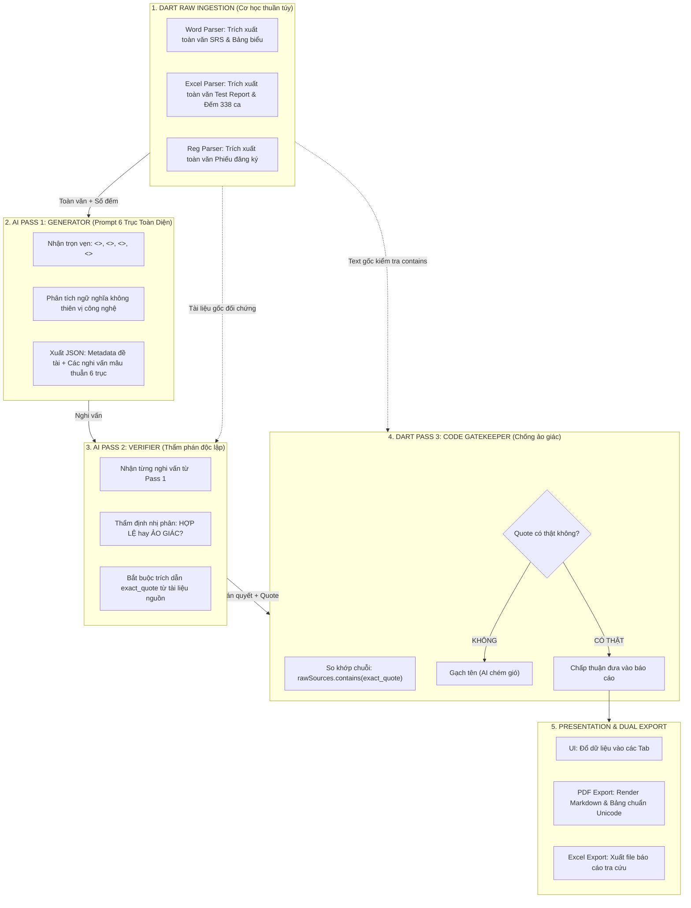

# Prompt-First Semantic Review Engine

## 1. Nguyên lý cốt lõi: Ai làm việc nấy

```
┌────────────────────────────────────────────────────────────────────────┐
│                        HAI NGUYÊN TẮC BẤT DI BẤT DỊCH                  │
│                                                                        │
│ 1. CODE DART = BẢN LỀ CƠ HỌC (0% ĐOÁN CHỮ):                           │
│    - Bóc tách toàn văn sạch từ file Word, Excel, Phiếu đăng ký.        │
│    - Đếm số dòng test case thật trong Excel (338 ca, không đếm nhầm).  │
│    - Kiểm tra chuỗi verbatim để chặn AI bịa quote (Quote Gatekeeper).  │
│    - Tuyệt đối KHÔNG dùng regex tìm từ khóa ngữ nghĩa: CSDL, hạ tầng,  │
│      tên đề tài, chức năng. Không cố cover 1 triệu từ của loài người.  │
│                                                                        │
│ 2. PROMPT LLM = BỘ NÃO ĐỌC HIỂU NGỮ NGHĨA:                            │
│    - Đọc toàn văn 3 tài liệu nguồn cùng lúc.                           │
│    - Tự bóc Tên đề tài, bối cảnh, công nghệ (dù sinh viên viết kiểu gì)│
│    - Tự đối chiếu chéo công nghệ (Postgres vs Azure SQL vs Viettel)    │
│    - Tự soi độ phủ tính năng (chức năng nào trong SRS bị bỏ quên)     │
│    - Tự bắt lỗi copy-paste, lỗi logic kiểm thử, lỗi diễn đạt           │
└────────────────────────────────────────────────────────────────────────┘
```

---

## 2. Luồng xử lý chi tiết (3-Pass Pipeline)



---

## 3. Nội dung Prompt AI Tổng Quát (The 6-Axis Semantic Prompt)

AI được cấp toàn văn 3 tài liệu và được yêu cầu phân tích **6 trục tổng quát cho MỌI ĐỒ ÁN**:

1. **Trích xuất Metadata Đồ án:**
   - Tự nhận diện Tên đề tài (Tiếng Anh, Tiếng Việt, Mã viết tắt) dù nó nằm ở dòng nào, bảng nào hay trang bìa nào.
   - Tự tóm tắt Bối cảnh / Mục tiêu đồ án từ phần nội dung, không nuốt bảng sinh viên/giảng viên.
2. **Trục 1: Mâu thuẫn Công nghệ & Kiến trúc (Cross-source Tech Stack):**
   - Tự đọc mục công nghệ của SRS vs Báo cáo vs Test Report. Bắt mọi mâu thuẫn copy-paste (Ví dụ: SRS ghi Viettel Cloud nhưng Excel test trên Azure SQL và Vercel; hoặc SRS bảo dùng Flutter nhưng Excel test React Native...).
3. **Trục 2: Độ phủ Tính năng & Chức năng bị bỏ quên (Feature Scope & Omission):**
   - Đọc danh sách chức năng trong SRS $\rightarrow$ Đối chiếu với danh sách test case trong Excel $\rightarrow$ Chỉ ra đích danh chức năng nào có trong đặc tả nhưng **bị bỏ quên 0 test case**.
4. **Trục 3: Vai trò & Phân quyền (Actor & RBAC):**
   - Soi các quyền hạn của từng Actor trong SRS vs Expected Result trong Test Cases (ví dụ: PM có được can thiệp vào thư mục riêng của Producer không).
5. **Trục 4: Lỗi Copy-Paste & Nhất quán giữa các Sheet:**
   - Phát hiện sheet dán nhầm requirement của sheet khác, phát hiện ca kiểm thử mâu thuẫn Pass/Fail.
6. **Trục 5: Tính Đúng Đắn của Logic Kiểm Thử (Business Logic Violations):**
   - Soi các trường hợp Expected Result cho phép hành vi vi phạm quy tắc nghiệp vụ đã nêu trong SRS (ví dụ: zone đã ban hành mà test case vẫn cho sửa/xóa).
7. **Trục 6: Chất lượng Viết & Trình bày (Wording & Formatting):**
   - Phát hiện bước test mơ hồ, thiếu Test Data, Expected Output chung chung, sai chính tả, thuật ngữ lộn xộn.

---

## 4. Các Phase triển khai

### Phase 1: Dọn dẹp Dart (Xóa sạch Regex đoán chữ) [COMPLETED]
- [x] **`cross_check_engine.dart`:** Xóa bỏ toàn bộ regex tìm kiếm từ khóa `database`, `environment`, `hạ tầng`. Chuyển phần đối chiếu môi trường/công nghệ sang cho AI đảm nhiệm.
- [x] **`coverage_stats.dart`:** Xóa bỏ logic đoán Use Case bằng regex; giữ lại tính toán số học khi có danh sách feature từ AI.
- [x] **`registration_pii.dart`:** Xóa bỏ regex `_topicLine` và cắt thô 1200 ký tự; giao việc nhận diện tên đề tài và bối cảnh cho AI trích xuất.

### Phase 2: Chuẩn hóa Pipeline AI & Data Contract (`ai_service.dart`) [COMPLETED]
- [x] **Data Contract JSON:** Thiết kế schema kết quả rõ ràng:
  - `project_info`: `{ "topic": "...", "description": "...", "tech_stack": [...] }`
  - `findings`: `[ { "axis": "Tech Mismatch | Feature Omission | RBAC | Copy-Paste | Logic | Wording", "claim": "...", "module": "...", "quote": "..." } ]`
- [x] **Pass 1 (Generator):** Cập nhật prompt 6 trục, nhận toàn văn 3 tài liệu.
- [x] **Pass 2 (Verifier):** Yêu cầu trích dẫn `exact_quote` nguyên văn từ tài liệu nguồn.
- [x] **Pass 3 (Gatekeeper):** Giữ nguyên hàm `verifyHypotheses` và `stripHallucinatedQuotes` kiểm tra `contains(quote)` trên toàn văn 3 file.

### Phase 3: Đồng bộ Report Composer & UI [COMPLETED]
- [x] **`review_report_composer.dart`:**
  - Nhận Tên đề tài & Mô tả từ kết quả AI trích xuất (chấm dứt hoàn toàn lỗi "Chưa xác định").
  - Đổ các phát hiện 6 trục của AI vào các mục báo cáo tương ứng.
  - Kết hợp số liệu cơ học do Dart đếm (338 ca, duplicate IDs).
- [x] **UI (`overview_tab.dart`, `verified_findings_tab.dart`):**
  - Hiển thị metadata và các phát hiện ngữ nghĩa trực quan theo 6 trục.

### Phase 4: Kiểm thử & Xác minh [COMPLETED]
- [x] Chạy unit test với mẫu phiếu Capstone thật.
- [x] Kiểm tra Quote Guard chặn đứng 100% các câu quote bịa.
- [x] Chạy `flutter test` bảo đảm toàn bộ suite pass (89/89 tests passing).

---

## 5. Kết quả Xác minh & Tiến độ
- **Trạng thái:** COMPLETED (Tiến độ: 100%)
- **Kết quả kiểm thử:** 89/89 tests passed (100% green suite).
- **Kiểm tra hồi quy & ảo giác:**
  - Quote Guard chặn 100% exact_quote giả mạo hoặc không xuất hiện verbatim trong tài liệu nguồn.
  - Zero regex guessing đối với CSDL, environment, topic title, use cases.
  - Đồng bộ trọn vẹn Report Composer, Excel Export và UI Tabs.
